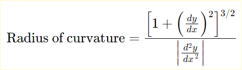
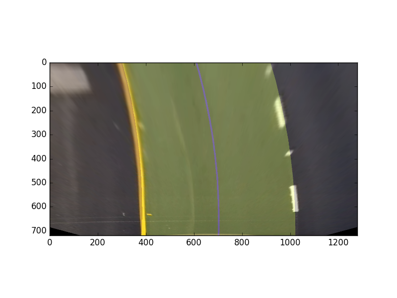

# **Advanced Lane Finding Project**
---

The goals / steps of this project are the following:

* Compute the camera calibration matrix and distortion coefficients given a set of chessboard images.
* Apply a distortion correction to raw images.
* Use color transforms, gradients, etc., to create a thresholded binary image.
* Apply a perspective transform to rectify binary image ("birds-eye view").
* Detect lane pixels and fit to find the lane boundary.
* Determine the curvature of the lane and vehicle position with respect to center.
* Warp the detected lane boundaries back onto the original image.
* Output visual display of the lane boundaries and numerical estimation of lane curvature and vehicle position.

[//]: # (Image References)

## [Rubric](https://review.udacity.com/#!/rubrics/571/view) Points

---
###Writeup / README

###Camera Calibration

#### 1. Briefly state how you computed the camera matrix and distortion coefficients. Provide an example of a distortion corrected calibration image.

The camera calibration is the process where the distortion created by the lenses in the camera are eliminated
from the image. OpenCV library includes functionality to remove this distortion, specifically three functions.

1. [`cv2.findChessboardCorners`](http://docs.opencv.org/2.4/modules/calib3d/doc/camera_calibration_and_3d_reconstruction.html#findchessboardcorners)
2. [`cv2.calibrateCamera`](http://docs.opencv.org/2.4/modules/calib3d/doc/camera_calibration_and_3d_reconstruction.html#calibratecamera)
3. [`cv2.undistort`](http://docs.opencv.org/2.4/modules/imgproc/doc/geometric_transformations.html#undistort)

The order of the functions is the order in which they have to be called, the function `cv2.calibrateCamera`
 returns a matrix and distortion coefficients, this are stored in a pickle file so we do not have to repeat
 the procedure each time.

In this solution, a class dedicated to image processing and transformation was created: [`img_proc.py`](https://github.com/yhoazk/CarND-Advanced-Lane-Lines/blob/master/test_images/img_proc.py)

This class implements the method [`camera_calibration`](https://github.com/yhoazk/CarND-Advanced-Lane-Lines/blob/master/test_images/img_proc.py#L28-L74)
where all the calibration is made and the pickle object is generated.

Next are the resulting images before and after calibration, the effect is visible in the edges of the image

### Pipeline (single images)

#### 1. Example of a distortion-corrected image.
Here is a demostration of how the image changes with the distortion. The affected pixels are at the edges
and OpenCV removes the edges and interpolates the image so we have as a result an image without distortion
and with the same size as the original.

Here is the image distortion applied to one image of the road used in this project.

#### 2. Describe how (and identify where in your code) you used color transforms, gradients or other methods to create a thresholded binary image.  Provide an example of a binary image result.

To detect the line lanes different color spaces where tested and also different edge detection algorithms,
and also different order in which the transformations where applied.

At the end, the edge detection algorithms were not really useful as they return some noisy images
and also take edges which are not if interest. The final process of binarization of the image is as follows:

1. With the birds view image as input, convert the image from BGR to HLS.
2. Apply a binary threshold to the channels L and S
3. As one channel is better for clear road and the other is good for dark road, discriminate the image.
    1. Take a patch from the center of the image with a stride of two.
    2. Sum all the pixels form the patch
    3. If the value is high then there are artifacts in the center of the image.
    4. change to the other channel which detects better the road conditions.
4. Return either channel L or S.

Here is an example of how this looks:
##### _Input image_

##### _Read patch_

##### _L Channel_

##### _S Channel_

Then the selected channel is the S channel, which give us the information needed. This is implemented
in the class [`Line.py`](./test_images/line.py) in the method: [`__get_ThresholdImg`](https://github.com/yhoazk/CarND-Advanced-Lane-Lines/blob/master/test_images/line.py#L57-L95)

#### 3. Getting the birds view perspective.

This perspective is useful as we will fit a polynomial with the information taken
from this image, if we not transform the image, the lanes look as if they weren't
parallel.

The class [`img_proc::get_birdsView`](https://github.com/yhoazk/CarND-Advanced-Lane-Lines/blob/master/test_images/img_proc.py#L76-L77) implements and describes the
warping/perspective transformation, the polygon is initializated in the `__init__` function for this class.
The selected values are a modification from the given as example for this project,
this resulted in the following source and destination points:

| Source        | Destination   |
|:-------------:|:-------------:|
| 577, 460      | 320, 0        |
| 240, 685      | 320, 720      |
| 1058, 685     | 970, 720      |
| 705, 460      | 970, 0        |

To verify that the transformtion was being as correct as possible the countour was drawn and displayed.

#### 4. Fitting the lane lines with a 2nd order polynomial.

In order to find the relevant white points and then fit the polynomial for the lane lines.
First a mask was created, this mask helps to reduce the noise from the objects near to the lanes and
in the center of the lane. This was implemented in the class [`Line::__get_hist_slice`](https://github.com/yhoazk/CarND-Advanced-Lane-Lines/blob/master/test_images/line.py#L133-L141).
Here is a short demo:
#### _Lane Without mask_

#### _Mask for the lane_

#### _Lane masked_

Then the image is divided in `n` horizontal sections, for each section the all the columns are summed to get a final
row with the same size of the image, this can be seen as plot:

In the image above, there are to peaks, for each side the top five values are found and the mean of its `x` location
is taken as where the center of the lane is for this section. This algorithm is repeated `n` times and its implemented in:
[`Line::__get_hist_slice`](https://github.com/yhoazk/CarND-Advanced-Lane-Lines/blob/master/test_images/line.py#L148 -L197).  

After this point the pixles are passed to the Polynomial fit function as a list x,y dots each representig the center of
the lane line, but before this they pass by a [`outlier_removal`](https://github.com/yhoazk/CarND-Advanced-Lane-Lines/blob/master/test_images/line.py#L97-L111) function.

The resulting list of points from the outlier removal, are passed to `np.polyfit` function, this calculates a 2nd order
polynommial which fits as best as it can, Here are the results for te test image.
#### _Fitted polynomial Right side:_

#### _Fitted polynomial Left side:_

####5. Describe how (and identify where in your code) you calculated the radius of curvature of the lane and the position of the vehicle with respect to center.

The radius of curvature is calculated a taking the mean of both polynomial and the by using the equation described [here](http://www.intmath.com/applications-differentiation/8-radius-curvature.php):

- - -

- - -

The implementation is in the class [`lane::get_Curvature`](https://github.com/yhoazk/CarND-Advanced-Lane-Lines/blob/master/test_images/lane.py#L71-_L94)

Get the vehicle position with respect to the center, is straight fordward,
having the center polynomial evaluate the point where the car is closest, ie.
`Y=720` this will give us the calculated center of the **lane** while if we consider
the camera to be in the center of the car, the difference between the center of the
image and the polynomial shall give us and aproximation to the offset.

The after mentioned operation is implemented in [`Lane::process_laneOffset`](https://github.com/yhoazk/CarND-Advanced-Lane-Lines/blob/master/test_images/lane.py#L56-L68)

#### 6. Image of the Plotted result on the image.

All the steps mentioned above are used to generate this final image where the lane
is marked with yellow and the information, offset and curvature, are also displayed
on the screen.

All the processing is made in [`Lane::process_lane`](https://github.com/yhoazk/CarND-Advanced-Lane-Lines/blob/master/test_images/lane.py#L96-L147)

Here is an example of the generated output:

---

### Pipeline (video)

Here's a [link to my video result](https://youtu.be/0h1-dbGwueY)

---

### Discussion

The methods used in this project were selected because their performance, line detection
algorithms were used at the beggining, but they did not improve the lines in the
thresholded image.
I had not enough time to implement the non-blind search, to remove the possible noise
from the sides of the image a mask was implemented, this helped in the accurracy of
the lines.

The video where this project works is somewhat ideal, the pipeline at this moment is
fragile as it relies almost in a 100% on the lane marks, if those lines are not
visible enough the algorithm will fail.

The conditions that may cause this are:
- Snow
- Other vehicles interfering the lanes
- Lane lines not marked
- Irregular color patches in the road
- Dawn, sunset, night ligth conditions
- Rain

Defenitely there is a lot of room for improvements in this project, but it is
a good start point.

This are some ideas how the pipeline could be improved:
- Detect the horizon to adjust the transformation polygon.
- Use the covariance Matrix to decide how good was the estimation.
- Perfom sensor fusion with other sensors, like radars or lidars.
- A better threshold algorithm, the implemented gives somewhat bad results in
    comparison to one used in GIMP. [GIMPs algorithm](https://docs.gimp.org/en/gimp-tool-threshold.html) yields a more solid and clean
    line.
