# **Advanced Lane Finding Project**
---

The goals / steps of this project are the following:

* Compute the camera calibration matrix and distortion coefficients given a set of chessboard images.
* Apply a distortion correction to raw images.
* Use color transforms, gradients, etc., to create a thresholded binary image.
* Apply a perspective transform to rectify binary image ("birds-eye view").
* Detect lane pixels and fit to find the lane boundary.
* Determine the curvature of the lane and vehicle position with respect to center.
* Warp the detected lane boundaries back onto the original image.
* Output visual display of the lane boundaries and numerical estimation of lane curvature and vehicle position.

[//]: # (Image References)

[image1]: ./examples/undistort_output.png "Undistorted"
[image2]: ./test_images/test1.jpg "Road Transformed"
[image3]: ./examples/binary_combo_example.jpg "Binary Example"
[image4]: ./examples/warped_straight_lines.jpg "Warp Example"
[image5]: ./examples/color_fit_lines.jpg "Fit Visual"
[image6]: ./examples/example_output.jpg "Output"
[video1]: ./project_video.mp4 "Video"

## [Rubric](https://review.udacity.com/#!/rubrics/571/view) Points
###Here I will consider the rubric points individually and describe how I addressed each point in my implementation.  

---
###Writeup / README

####1. Provide a Writeup / README that includes all the rubric points and how you addressed each one.

###Camera Calibration

####1. Briefly state how you computed the camera matrix and distortion coefficients. Provide an example of a distortion corrected calibration image.

The camera calibration is the process where the distortion created by the lenses in the camera are eliminated
from the image. OpenCV library includes functionality to remove this distortion, specifically three functions.

1. [`cv2.findChessboardCorners`](http://docs.opencv.org/2.4/modules/calib3d/doc/camera_calibration_and_3d_reconstruction.html#findchessboardcorners)
2. [`cv2.calibrateCamera`](http://docs.opencv.org/2.4/modules/calib3d/doc/camera_calibration_and_3d_reconstruction.html#calibratecamera)
3. [`cv2.undistort`](http://docs.opencv.org/2.4/modules/imgproc/doc/geometric_transformations.html#undistort)

The order of the functions is the order in which they have to be called, the function `cv2.calibrateCamera`
 returns a matrix and distortion coefficients, this are stored in a pickle file so we do not have to repeat
 the procedure each time.
 
In this solution, a class dedicated to image processing and transformation was created: [`img_proc.py`](https://github.com/yhoazk/CarND-Advanced-Lane-Lines/blob/master/test_images/img_proc.py)

This class implements the method [`camera_calibration`](https://github.com/yhoazk/CarND-Advanced-Lane-Lines/blob/master/test_images/img_proc.py#L28-L74)
where all the calibration is made and the pickle object is generated.

Here are the resulting images before and after calibration, the effect is visible in the edges of the image:

###Pipeline (single images)

####1. Example of a distortion-corrected image.
Here is a demostration of how the image changes with the distortion. The affected pixels are at the edges
and OpenCV removes the edges and interpolates the image so we have as a result an image without distortion
and with the same size as the original.

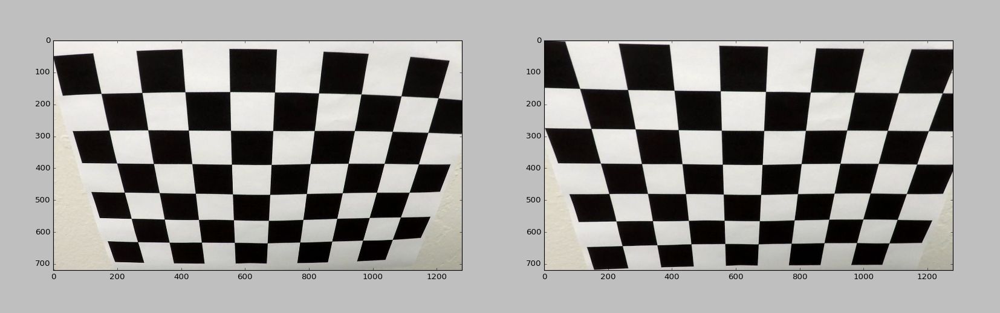
Here is the image distortion applied to one image of the road used in this project.
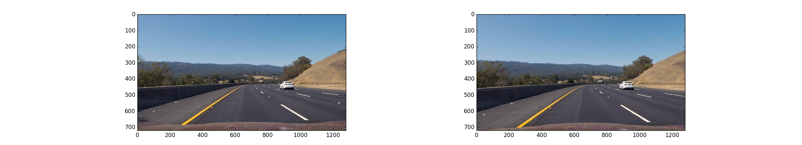

####2. Describe how (and identify where in your code) you used color transforms, gradients or other methods to create a thresholded binary image.  Provide an example of a binary image result.

To detect the line lanes different color spaces where tested and also different edge detection algorithms,
and also different order in which the transformations where applied.

At the end, the edge detection algorithms were not really useful as they return some noisy images
and also take edges which are not if interest. The final process of binarization of the image is as follows:

1. With the birds view image as input, convert the image from BGR to HLS.
2. Apply a binary threshold to the channels L and S
3. As one channel is better for clear road and the other is good for dark road, discriminate the image.
    1. Take a patch from the center of the image with a stride of two.
    2. Sum all the pixels form the patch
    3. If the value is high then there are artifacts in the center of the image.
    4. change to the other channel which detects better the road conditions.
4. Return either channel L or S.

Here is an example of how this looks:
##### _Input image_
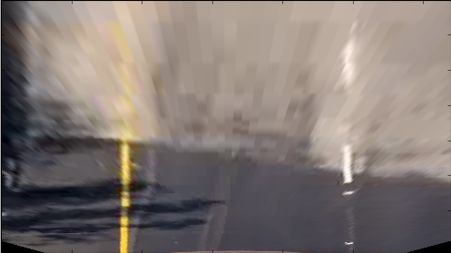
##### _Read patch_
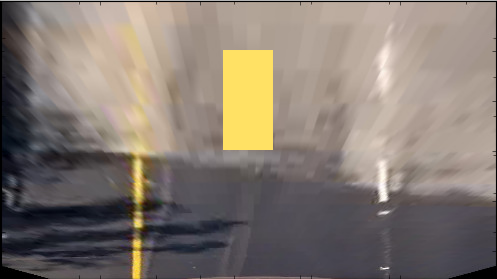
##### _L Channel_ 
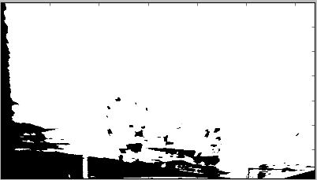
##### _S Channel_
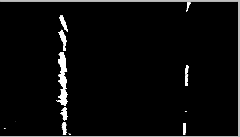

Then the selected channel is the S channel, which give us the information needed. This is implemented
in the class [`Line.py`](./test_images/line.py) in the method: [`__get_ThresholdImg`](https://github.com/yhoazk/CarND-Advanced-Lane-Lines/blob/master/test_images/line.py#L57-L95)

####3. Describe how (and identify where in your code) you performed a perspective transform and provide an example of a transformed image.

The code for my perspective transform includes a function called `warper()`, which appears in lines 1 through 8 in the file `example.py` (output_images/examples/example.py) (or, for example, in the 3rd code cell of the IPython notebook).  The `warper()` function takes as inputs an image (`img`), as well as source (`src`) and destination (`dst`) points.  I chose the hardcode the source and destination points in the following manner:

The class [`img_proc::get_birdsView`](https://github.com/yhoazk/CarND-Advanced-Lane-Lines/blob/master/test_images/img_proc.py#L76-L77) implements and describes the 
warping/perspective transformation, the polygon is initializated in the `__init__` function for this class.
The selected values are a modification from the given as example for this project, 
this resulted in the following source and destination points:

| Source        | Destination   | 
|:-------------:|:-------------:| 
| 577, 460      | 320, 0        | 
| 240, 685      | 320, 720      |
| 1058, 685     | 970, 720      |
| 705, 460      | 970, 0        |

To verify that the transformtion was being as correct as possible the countour was drawn and displayed.
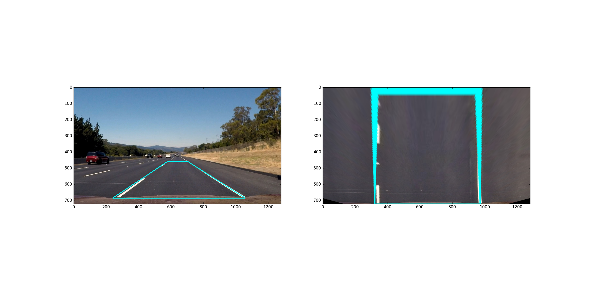

####4. Describe how (and identify where in your code) you identified lane-line pixels and fit their positions with a polynomial?

In order to find the relevant white points and then fit the polynomial for the lane lines.
First a mask was created, this mask helps to reduce the noise from the objects near to the lanes and
in the center of the lane. This was implemented in the class [`Line::__get_hist_slice`](https://github.com/yhoazk/CarND-Advanced-Lane-Lines/blob/master/test_images/line.py#L133-L141).
Here is a short demo:
#### _Lane Without mask_
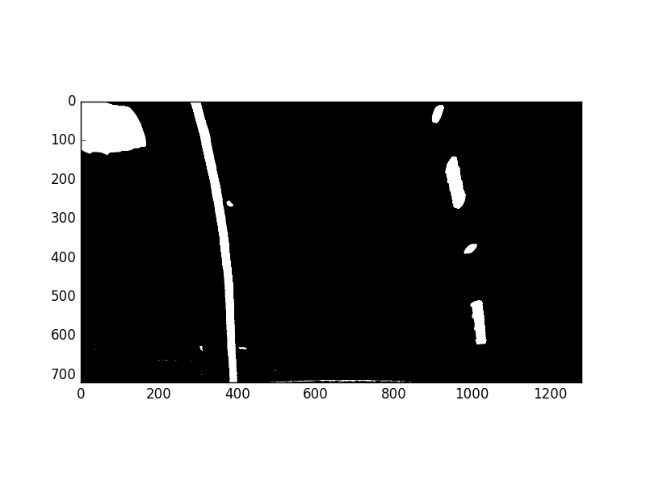
#### _Mask for the lane_
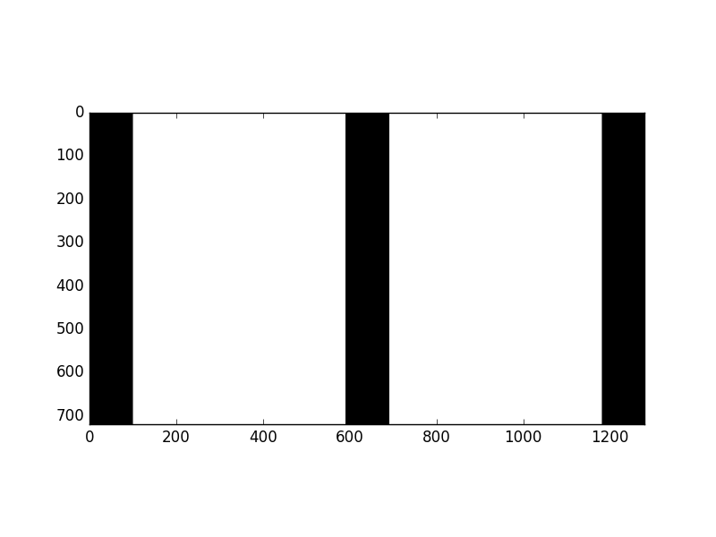
#### _Lane masked_
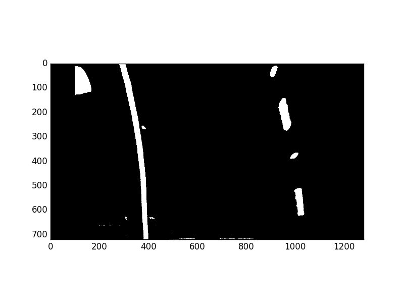

Then the image is divided in `n` horizontal sections, for each section the all the columns are summed to get a final
row with the same size of the image, this can be seen as plot:
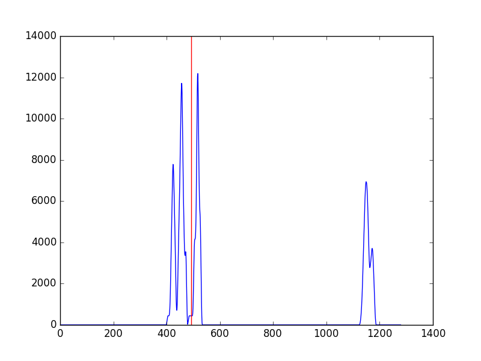

In the image above, there are to peaks, for each side the top five values are found and the mean of its `x` location
is taken as where the center of the lane is for this section. This algorithm is repeated `n` times and its implemented in:
[`Line::__get_hist_slice`](https://github.com/yhoazk/CarND-Advanced-Lane-Lines/blob/master/test_images/line.py#L148 -L197).  

After this point the pixles are passed to the Polynomial fit function as a list x,y dots each representig the center of
the lane line, but before this they pass by a [`outlier_removal`](https://github.com/yhoazk/CarND-Advanced-Lane-Lines/blob/master/test_images/line.py#L97-L111) function.

The resulting list of points from the outlier removal, are passed to `np.polyfit` function, this calculates a 2nd order
polynommial which fits as best as it can, Here are the results for te test image.
#### _Fitted polynomial Right side:_
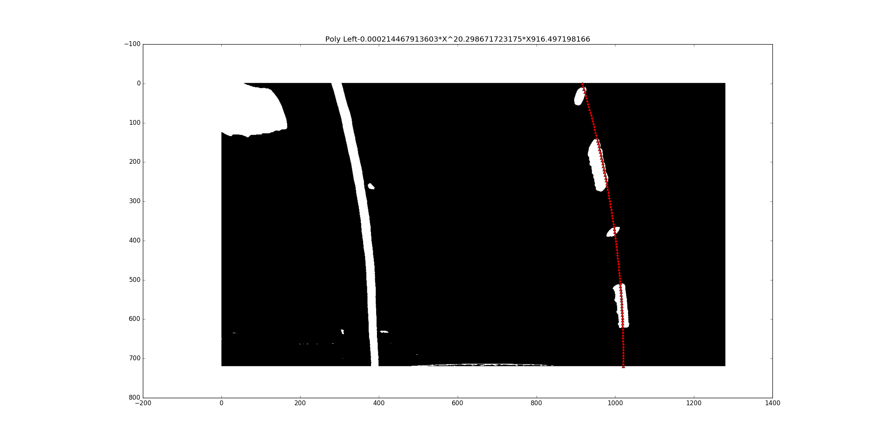
#### _Fitted polynomial Left side:_
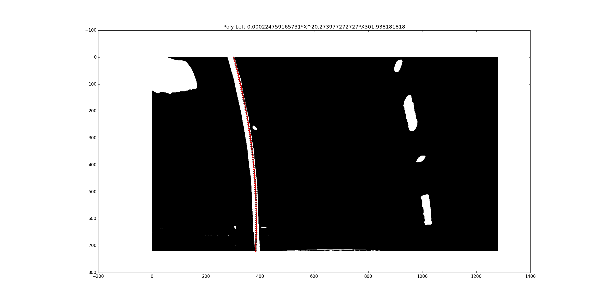

####5. Describe how (and identify where in your code) you calculated the radius of curvature of the lane and the position of the vehicle with respect to center.

The radius of curvature is calculated a taking the mean of both polynomial and the by using the equation described [here](http://www.intmath.com/applications-differentiation/8-radius-curvature.php):

- - -
Radius&nbsp;of&nbsp;curvature=&#8203;&#8203;∣&#8203;∣&#8203;∣&#8203;&#8203;&#8203;dx&#8203;2&#8203;&#8203;&#8203;&#8203;d&#8203;2&#8203;&#8203;y&#8203;&#8203;&#8203;∣&#8203;∣&#8203;∣&#8203;&#8203;&#8203;&#8203;[1+(&#8203;dx&#8203;&#8203;dy&#8203;&#8203;)&#8203;2&#8203;&#8203;]&#8203;3/2&#8203;&#8203;&#8203;&#8203;
- - -

The implementation is in the class [`lane::get_Curvature`](https://github.com/yhoazk/CarND-Advanced-Lane-Lines/blob/master/test_images/lane.py#L71-_L94)

For the vehicle position with respect to the center, is straight fordward,
having the center polynomial evaluate the point where the car is closest, ie.
`Y=720` this will give us 

####6. Provide an example image of your result plotted back down onto the road such that the lane area is identified clearly.

I implemented this step in lines # through # in my code in `yet_another_file.py` in the function `map_lane()`.  Here is an example of my result on a test image:

![alt text][image6]

---

###Pipeline (video)

####1. Provide a link to your final video output.  Your pipeline should perform reasonably well on the entire project video (wobbly lines are ok but no catastrophic failures that would cause the car to drive off the road!).

Here's a [link to my video result](./project_video.mp4)

---

###Discussion

####1. Briefly discuss any problems / issues you faced in your implementation of this project.  Where will your pipeline likely fail?  What could you do to make it more robust?

Here I'll talk about the approach I took, what techniques I used, what worked and why, where the pipeline might fail and how I might improve it if I were going to pursue this project further.  

